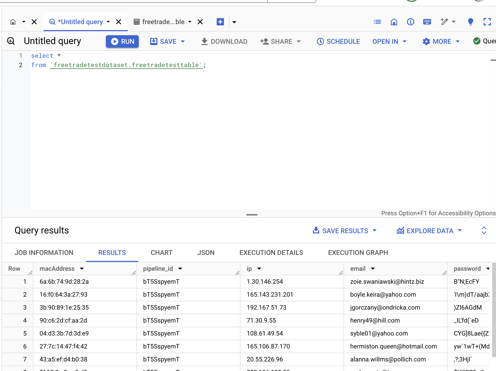

# Freetrade Technical Test

Freetrade technical test background information.

## Instructions to run

1) Run the docker image using ./run-docker-image.sh from inside the freetrade directory.
2) Use docker compose from the deploys/docker-compose directory

Env file (included in repo for ease of running):

```markdown
GCS_BUCKET_NAME=freetrade-data-eng-hiring
GCS_BLOB_PREFIX=james_walden
GCS_BLOB_NAME=data_engineering_task.json
```

## Development environment

This project uses poetry to manage dependencies.

I use pyenv to manage virtual environments.

Create a new virtualenv using pyenv, `pyenv virtualenv 3.10 freetrade-env`.

Set new env to be local env in freetrade directory, `pyenv local freetrade-env`.

Run poetry install to install all deps including dev, `poetry install`.

To lint and test, use the Makefile from inside the freetrade directory, e.g.:

- `make lint`
- `make test`
- `make run_pipeline`

## Storage Format

- Parquet, best used with larger files, data for 100 users is only about 20kb so inappropriate format here. When data volumes are much larger this would be more efficient for storage.
- CSV
- JSON, since the api is returning data in this format this seems like the most appropriate choice.
- <https://cloud.google.com/bigquery/docs/loading-data>
- Avro, ORC, haven't encountered either of these before, ORC seems more appropriate for the Hadoop ecosystem and Avro appears to also be better for larger datasets.

## BigQuery Compatibility

Noted that don't actually need to load it into BigQuery but figured it was a good test to see if the format was compatible.



## Improvements

- tightly coupled to the users endpoint of faker, could generalise
- no integration tests